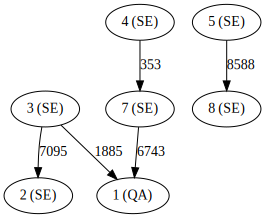

# Penningtvättsjakten

I jakt på penningtvättshärvor analyseras penningtransaktioner under ett visst tidsfönster. Använd länkarna för att ladda ner data för [konton](./edf3cc687027af2e23eb4ab742cbf587/raw/ba7993b54e2a52dc766ddb6baf956df9dbb43681/accounts.csv) respektive [transaktioner](./edf3cc687027af2e23eb4ab742cbf587/raw/495674fe24a471f729e552299cda106423dd6098/transactions.csv). 

För konton anges 
* Kontonummer (heltal)
* Landskod (två bokstäver)

För transaktioner anges
* Frånkonto (kontonummer)
* Tillkonto (kontonummer)
* Belopp (heltal, normaliserat till valutan pengar)

*Om det för en transaktion anges "-" som till- eller frånkonto betyder det att det är en kontanttransaktion.*

Misstänkta transaktioner och konton ges poäng enligt enligt följande regelverk
 * Större transaktioner, belopp &GreaterEqual; 25.000: 1 poäng
 * Större kontanttransaktioner, belopp &GreaterEqual; 5.000: 1 poäng
 * Internationella transaktioner: 1 poäng
 * Högaktivt konto: 1 poäng (där ett högaktivt konto är ett som har 5 eller fler transaktioner; både insättningar och uttag räknas)
 
 Förtydliganden
 * *Kontanttransaktioner är aldrig internationella*
 * *En kontanttransaktion på mer än 25.000 ger två poäng då den matchar två regler*
 
I bilden nedan anges ett exempel med konton och transaktioner.

* Det finns 7 konton vilka illustreras med cirklar. Kontonumret anges i cirkelns mitt och landskoden är inom parantes.
* Det finns 5 transaktioner vilket illustreras med pilar. Pilarnas etikett anger transaktionsbeloppet.
* Transaktionen mellan konto 7 och konto 1 är på beloppet 6743 pengar
* Transaktionen mellan konto 7 och konto 1 är internationell då frånkontot har landskod **SE** och tillkontot **QA**
* Bilden visar två transaktionsnätverk; { 4, 7, 1, 3, 2 } respektive { 5, 8 }
* Det finns inga högaktiva konton. Konto 3 har högst aktivitet med sina två transaktioner.
* Inga kontanttransaktioner finns med i bilden då alla transaktioner går från ett konto till ett annat

Hitta det transaktionsnätverk vars ingående transaktioner och konton ger högst poäng.
